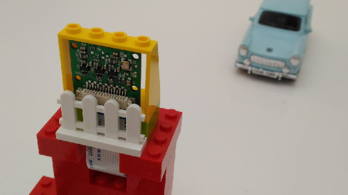
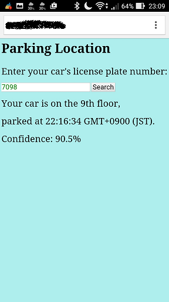

#Where is my car?

This is my second IoT (Internet of Things) project as my hobby.

##The IoT toy I develop





##Background and motivation

I go shopping at these malls on weekends. The problem is that sometimes I do not remember where I parked my car...

- [Northport Mall, Yokohama](https://www.google.co.jp/maps/@35.5507775,139.5792885,3a,75y,2h,101.12t/data=!3m6!1e1!3m4!1sr2XS6qJGnbIkwTT953SWPA!2e0!7i13312!8i6656)
- [Sogo, Kashiwa](https://www.google.co.jp/maps/@35.8644843,139.9731393,3a,75y,144.06h,112.16t/data=!3m6!1e1!3m4!1sHc9UH1NphEztWjDAM0G-Bg!2e0!7i13312!8i6656)
- [AEON mall, Makuhari](https://www.google.co.jp/maps/@35.6573085,140.0245396,3a,75y,154.86h,91.46t/data=!3m6!1e1!3m4!1sQEXUIVr33EV5ebIr5tE0rA!2e0!7i13312!8i6656)

[OpenALPR](https://github.com/openalpr/openalpr) is a very interesting open source software to tackle the problem. I just want to try out the software with my Raspberry Pi 3. That is the motivation.

##Architecture

####Goal

Why is beacon(Eddystone) required for this system? Get rid of an expensive special-purpose Kiosk, just use your smart phone that detects beacon, extracts an URL of a car search page from the beacon, and opens up Chrome browser.


####Minimum setup

Everything runs on my Raspberry Pi 3 except for the device management.


##Software components used in this project
- node.js/express/angular.js with cassandra-driver
- [OpenALPR](https://github.com/openalpr/openalpr)
- [beanstalkd](http://kr.github.io/beanstalkd/)
- [node-eddystone-beacon](https://github.com/don/node-eddystone-beacon)
- [Cassandra](http://cassandra.apache.org)

##Building OpenALPR on Raspberry Pi

First, you have to build OpenCV. Follow the instructions here: http://docs.opencv.org/3.0-last-rst/doc/tutorials/introduction/linux_install/linux_install.html

Don't forget to install libv4l-dev before cmake:
```
$ sudo apt-get install libv4l-dev
```
And add this option to cmake: -DWITH_LIBV4L=ON

It took one hour to complete the build processes.

Then, follow the instructions on this page: https://github.com/openalpr/openalpr/wiki/Compilation-instructions-%28Ubuntu-Linux%29

It took some ten minutes.

Check if ALPR works on your Raspberry Pi:
```
pi@raspberrypi:/tmp $ wget http://plates.openalpr.com/h786poj.jpg -O lp.jpg
--2016-05-10 20:45:51--  http://plates.openalpr.com/h786poj.jpg
Resolving plates.openalpr.com (plates.openalpr.com)... 54.231.114.105
Connecting to plates.openalpr.com (plates.openalpr.com)|54.231.114.105|:80... connected.
HTTP request sent, awaiting response... 200 OK
Length: 62721 (61K) [image/jpeg]
Saving to: ‘lp.jpg’

lp.jpg              100%[=====================>]  61.25K   125KB/s   in 0.5s

2016-05-10 20:45:52 (125 KB/s) - ‘lp.jpg’ saved [62721/62721]

pi@raspberrypi:/tmp $ alpr lp.jpg
plate0: 8 results
    - 786P0      confidence: 90.1703
    - 786PO      confidence: 85.579
    - 786PQ      confidence: 85.3442
    - 786PD      confidence: 84.4616
    - 7B6P0      confidence: 69.4531
    - 7B6PO      confidence: 64.8618
    - 7B6PQ      confidence: 64.627
    - 7B6PD      confidence: 63.7444
```

It took something like 10 seconds to recognize a number, so it is not plactical -- you should run alprd instead.

##node.js/express

You must install a middleware 'body-parser' for express POST operations:
```
$ sudo npm -g install body-parser
```

```
var bodyParser = require('body-parser');

app.use(bodyParser.urlencoded({ extended: true }));
app.use( bodyParser.json() );

app.post(  ...
```

##Cassandra setup

[Cassandra installation onto Raspberry Pi](./doc/cassandra.md)

You can run Cassandra on Raspberry Pi. But it might not be a good idea, since Cassandra consumes a lot of memory.

##Web page for searching your car

AngularJS-based page: [index.html](./www/index.html)



##Emitting URL of the web page from your Raspberry Pi

Include the following in your Java script:
```
require('./beacon.js')
```


The 'beacon.js' script is [here](./beacon.js).

##OpenALPR training for Japanese car licence plates

In case of the default setting (country = us),  "2" can be recognized as "Z", and "0" as "O" or "D". For the time being, you may use country = us and use a matching pattern "####(4 digits)" by modifying the following file:
https://github.com/openalpr/openalpr/blob/master/runtime_data/postprocess/us.patterns

To get most out of OpenALPR, you must train it. Take pictures of Japanese license plates, then use the following utilites to train it:
- https://github.com/openalpr/train-ocr
- https://github.com/openalpr/train-detector

##Issues

- My USB webcam stops working just after I have started Cassandra. I disabled wlan0, but it does not solve the problem.
- My powered USB 3.0 hub does not work with Raspberry Pi. See this page: https://www.raspberrypi.org/documentation/hardware/raspberrypi/usb/README.md

So I have bought a camera module for RPi:
- https://www.raspberrypi.org/products/camera-module/
- https://www.raspberrypi.org/documentation/usage/camera/

Don't forget to load the following kernel module for V4L2: 
```
$ sudo modprobe bcm2835-v4l2
```

##Wish list

#### Docker-based software management for IoT gateways (i.e., Raspberry Pi 3)

AWS Shadow is OK, but AWS does not support software life cycle management (such as software upgrade) for IoT gateways. I use neither Chef, Puppet nor Ansible, since these tools make things complicated. I want something like [Resin.io](https://resin.io/) that is based on Docker.

I should also check out [Google Brillo](https://developers.google.com/brillo/).

##Do I need ??? Time for reality check!

####Do I need MQTT?
No, I don't. alprd/beanstalkd and nodejs-based REST server (app.js) suffice for the time being. 

I just use MQTT for IoT management, since AWS provides MQTT-based device management features.

####Do I need MongoDB?
No, I don't. I prefer Cassandra over MongoDB. Cassandra is goot at write-intensive operations and scales out horizontally, thus suitable for this system.

####Do I need AWS DynamoDB and Lambda?
No, I don't. The combination of "beanstalkd - app.js(node.js/express) - Cassandra" is much simplar and cheaper than those of AWS. I can even create a cluster of Cassandra with multiple Raspberry Pi 3. In near future, I will try that.

####Do I need an IOT framework/platform?
No, I don't. It's a lot easier and faster to develop an IOT system based on MEAN stack with your preferred SQL/NoSQL rather than a heavy-weight framework/platform -- maybe, it depends on your requirements. 
