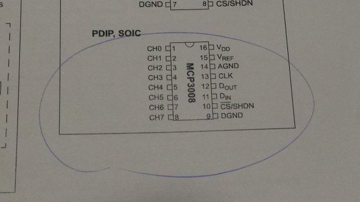
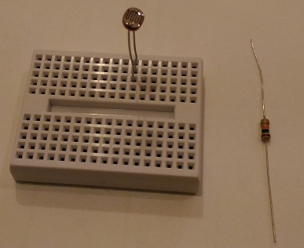
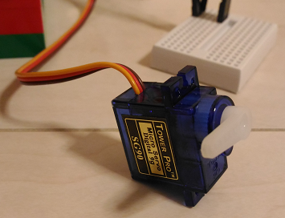
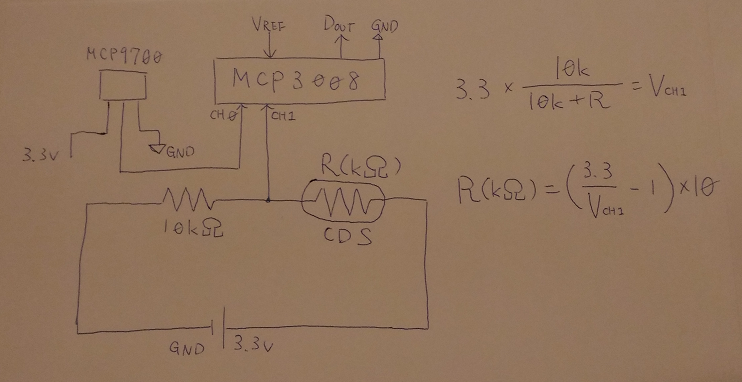
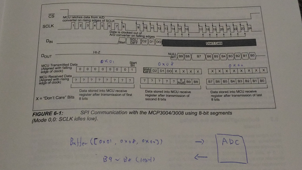

# Electronic kit

I bought this kit: https://www.amazon.co.jp/gp/product/B00MRQ5U1Y/ref=oh_aui_detailpage_o00_s00?ie=UTF8&psc=1

##Parts

- [MCP3008](https://cdn-shop.adafruit.com/datasheets/MCP3008.pdf)



- [MCP9700-E/TO](http://ww1.microchip.com/downloads/en/DeviceDoc/21942e.pdf)


- [MI5](http://akizukidenshi.com/download/ds/macron/MI5_series_jp.pdf)



- [SG90(Servo motor)](http://akizukidenshi.com/download/ds/towerpro/SG90.pdf)



I have installed [pi-blaster](https://github.com/sarfata/pi-blaster) to enable PWM on my Raspberry Pi 3.

I modified the constant in "pi-blaster.c" to adjust PWM frequency to 50Hz:
```
- #define CYCLE_TIME_US   10000
+ #define CYCLE_TIME_US   20000
  #define SAMPLE_US               10
  #define NUM_SAMPLES             (CYCLE_TIME_US/SAMPLE_US)
  #define NUM_CBS                 (NUM_SAMPLES*2)
```

I connected my servo motor (SG90) to GPIO21, 5V and GND, then I tested that the motor rotates its arm from -90 degree to +90 degree:
```
$ sudo ./pi-blaster -g 21
$ sudo echo "21=0.025" > /dev/pi-blaster
$ sudo echo "21=0.125" > /dev/pi-blaster
```

## Temperature calculation

####MCP9700 DC electrical characteristics


####MCP3008 digital output code calculation


####Temperature calculation


##Luminousity calculation



##Communicating with MCP3008 via SPI

Control bit: 1000


Send [0x01, 0x80, 0x00] from your Raspberry Pi to MCP3008 via SPI. MCP3008 returns 10bit data (value range: 0 - 1023).



##Code
I made [this code](../thing/adc.js) to obtain the output from MCP3008(CH0 and CH1) and calcuate the temperature and luminousity.

##Wirling

|Pin|Name     |Direction|Part            |
|---|---------|---------|----------------|
|9  |GND      |         |                |
|17 |3.3V     |         |                |
|19 |SPI0 MOSI|         | AD converter   |
|21 |SPI0 MISO|         | AD converter   |
|23 |SPI0 SCLK|         | AD converter   |
|24 |SPI0 CS0 |         | AD converter   |
|29 |GPIO5    | out     | LED green      |
|31 |GPIO6    | out     | LED red        |
|33 |GPIO13   | out     | piezo buzzer   |
|35 |GPIO19   | in      | tactile switch |

Note: one analog thermistor and one CdS are connected to the AD converter.
